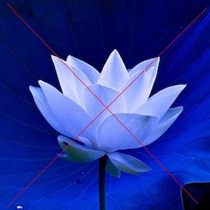

# foolme - misc

> Can you fool me?
> nc 202.112.51.176 9999
> (FLAG format: BCTF{})
> [Download Attachments](./c08be7bc-c68e-4c18-8372-f3167c92fc97.zip)

This is a challenge that receives a base64 encoded image, compares it to a reference image, and if they are similar enough, sends both the submitted image and reference image through the [Inception image classifier neural network](https://github.com/Hvass-Labs/TensorFlow-Tutorials/blob/master/inception.py). If the images are classified as different objects, you get the flag.

The first similarity comparison is a simple bytewise difference comparison between the raw RGB data of the images. The threshold is width\*height\*bytes_per_pixel\*3, which with the 299\*299\*3 size of the reference image gives us a minimum of 3143 bytes - over 1000 pixels that can be fully changed. In practice, a lot more, since the minimum only happens when a pixel changes from pure white to pure black.

So, what kind of things might be confusing for a neural network? I thought about projects like [CV Dazzle](https://cvdazzle.com/) which camouflages faces with bright colors and hard lines, and decided to just paint a couple of thin lines in high contrast across the image:

I saved the image, ensuring that JPEG quality was 100% avoid recompression noise that could trigger the threshold, and uploaded it. And it worked - got the flag!
